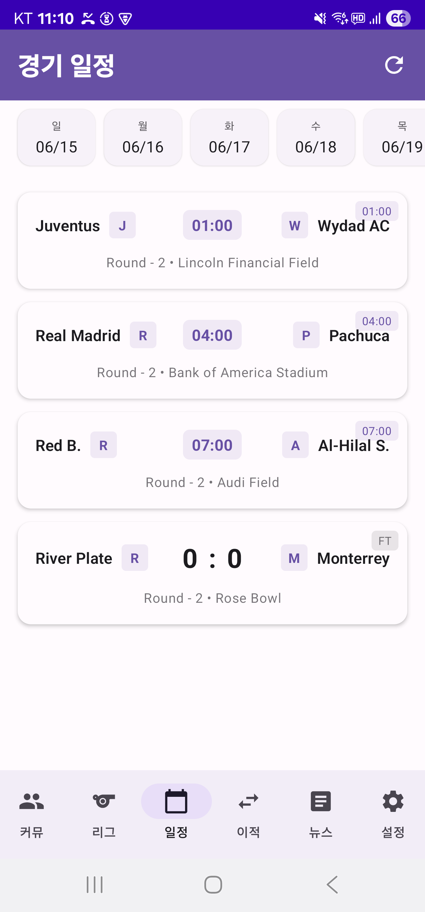

# FutInfo V9 - 크로스플랫폼 축구 커뮤니티 앱

<div align="center">
  
  
  [](https://developer.apple.com/ios/)
  [](https://developer.android.com/)
  [](https://nextjs.org/)
  [](https://supabase.com/)
</div>

## 🌟 프로젝트 소개

FutInfo는 전 세계 축구 팬들을 위한 종합 플랫폼입니다. iOS, Android, Web에서 완벽하게 동기화되는 커뮤니티 경험을 제공합니다.

### 주요 기능

- 📱 **크로스플랫폼**: iOS, Android, Web 완벽 지원
- ⚡ **실시간 동기화**: 모든 플랫폼에서 즉시 동기화
- 🏆 **팀별 커뮤니티**: 좋아하는 팀 전용 게시판
- 📊 **실시간 경기 정보**: 라이브 스코어 및 통계
- 📰 **뉴스 & 이적정보**: 최신 축구 소식
- 🌍 **글로벌 지원**: 다국어 지원

## 🏗️ 프로젝트 구조

```
futinfo_v9/
├── football/          # iOS 앱 (SwiftUI)
├── Android/           # Android 앱 (Kotlin Compose)
├── web/              # 웹 앱 (Next.js)
├── supabase/         # Backend (Supabase Edge Functions)
├── design-system/    # 공통 디자인 시스템
└── shared/           # 공유 리소스
```

## 🛠️ 기술 스택

### iOS
- **SwiftUI** - UI 프레임워크
- **Combine** - 반응형 프로그래밍
- **Core Data** - 로컬 데이터베이스
- **Supabase SDK** - 백엔드 연동

### Android
- **Kotlin** - 프로그래밍 언어
- **Jetpack Compose** - UI 툴킷
- **Room** - 로컬 데이터베이스
- **Hilt** - 의존성 주입

### Web
- **Next.js 14** - React 프레임워크
- **TypeScript** - 타입 안정성
- **Tailwind CSS** - 스타일링
- **React Query** - 상태 관리

### Backend
- **Supabase** - PostgreSQL 데이터베이스
- **Edge Functions** - 서버리스 API
- **Realtime** - WebSocket 실시간 통신
- **Auth** - 통합 인증 시스템

## 🚀 빠른 시작

### 사전 요구사항
- Xcode 15+ (iOS 개발)
- Android Studio (Android 개발)
- Node.js 18+ (웹 개발)
- Supabase 계정

### iOS 앱 실행
```bash
cd football
open football.xcodeproj
# Xcode에서 빌드 및 실행
```

### Android 앱 실행
```bash
cd Android
./gradlew assembleDebug
# Android Studio에서 실행
```

### 웹 앱 실행
```bash
cd web
npm install
cp .env.example .env.local
# Supabase 설정 추가 후
npm run dev
```

## 📊 주요 성과

- ✅ **실시간 동기화**: 3개 플랫폼 간 완벽한 동기화
- ✅ **성능 최적화**: 28-31초 → 5-10초 로딩 시간 단축
- ✅ **캐싱 시스템**: 다층 캐시로 오프라인 지원
- ✅ **보안 강화**: RLS 및 검증 시스템
- ✅ **확장성**: 모듈화된 아키텍처

## 🔧 최근 업데이트

### v9.0 (2025.01)
- 🎉 웹 플랫폼 추가
- 🚀 팀 게시판 로딩 최적화
- 🔄 실시간 동기화 개선
- 🛡️ 보안 및 에러 처리 강화

## 📱 스크린샷

<div align="center">
  
  
</div>

## 🤝 기여하기

1. Fork the Project
2. Create your Feature Branch (`git checkout -b feature/AmazingFeature`)
3. Commit your Changes (`git commit -m 'Add some AmazingFeature'`)
4. Push to the Branch (`git push origin feature/AmazingFeature`)
5. Open a Pull Request

## 📄 라이선스

이 프로젝트는 MIT 라이선스 하에 있습니다. 자세한 내용은 [LICENSE](LICENSE) 파일을 참조하세요.

## 🔗 관련 링크

- [프로젝트 문서](https://github.com/generalaimaker/futinfo_v9/wiki)
- [API 문서](https://github.com/generalaimaker/futinfo_v9/wiki/API-Documentation)
- [디자인 시스템](design-system/README.md)
- [기여 가이드](CONTRIBUTING.md)

## 📞 연락처

- GitHub Issues: [버그 리포트 & 기능 제안](https://github.com/generalaimaker/futinfo_v9/issues)
- Email: futinfo@example.com

---

<div align="center">
  Made with ❤️ by FutInfo Team
</div>