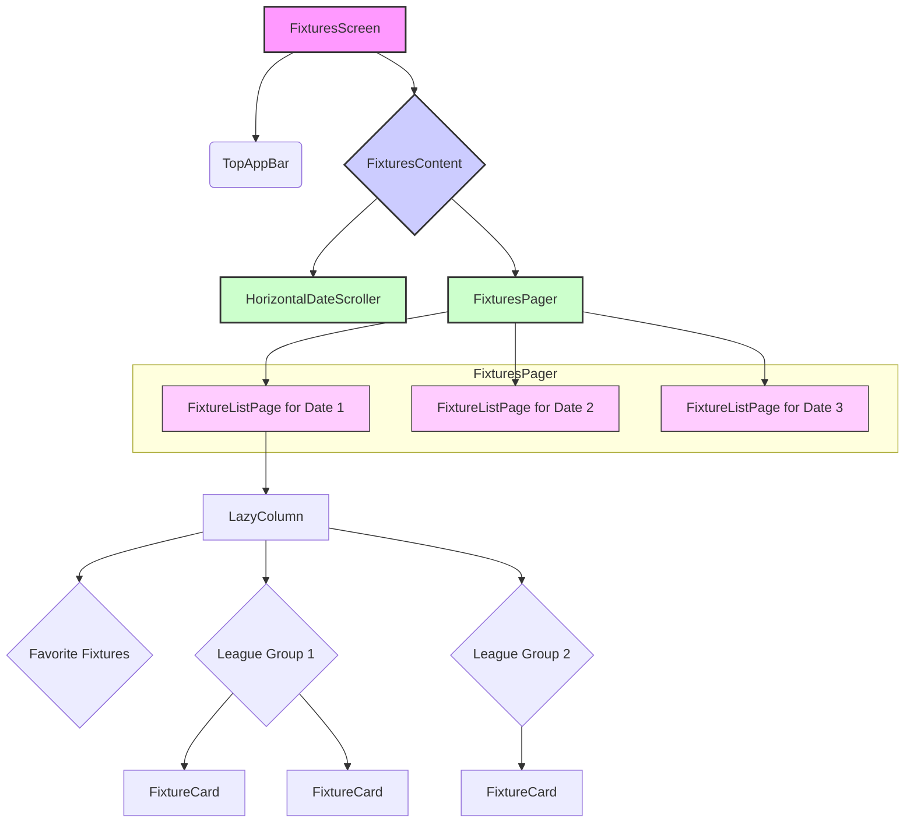
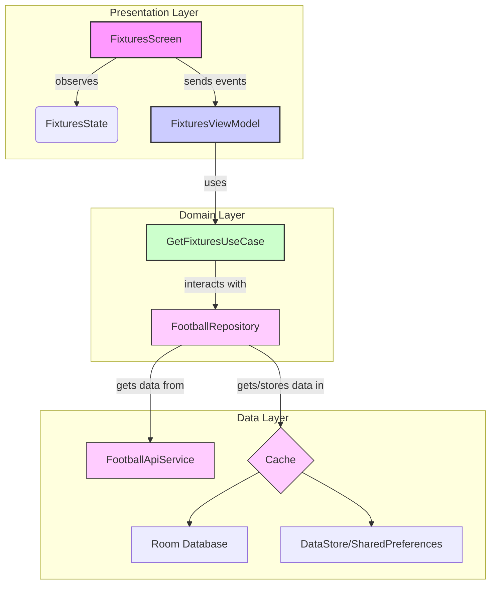

# Android Fixtures Tab Architecture Design

## 1. iOS 앱 구조 분석 요약

### UI/View
- **`FixturesOverviewView`**: 메인 뷰. 상단 날짜 탭(`FixturesDateTabsView`)과 페이징되는 경기 목록(`FixturesPageTabView`)으로 구성.
- **`FixturesDateTabsView`**: 좌우 스크롤이 가능한 날짜 선택 탭. `ScrollViewReader`를 사용해 선택된 날짜로 자동 스크롤.
- **`FixturesPageTabView`**: `TabView`와 `PageTabViewStyle`을 사용해 날짜별 경기 목록을 좌우 스와이프로 넘길 수 있도록 구현.
- **`FixturePageView`**: 특정 날짜의 경기 목록을 표시하는 뷰. `ScrollView` 내에서 즐겨찾기 팀과 리그별로 경기를 그룹화하여 보여줌.
- **`FixtureCardView`**: 개별 경기 정보를 표시하는 카드 형태의 뷰.

### ViewModel
- **`FixturesOverviewViewModel`**:
    - **데이터 관리**: `fixtures: [Date: [Fixture]]` 형태로 날짜별 경기 데이터를 관리.
    - **상태 관리**: `isLoading`, `errorMessage`, `loadingDates` 등 UI 상태를 관리.
    - **캐싱**: `UserDefaults`와 `CoreData`를 함께 사용한 다층 캐싱 전략. 경기 상태(라이브, 예정, 종료) 및 날짜(과거, 오늘, 미래)에 따라 캐시 만료 시간을 다르게 설정.
    - **미리 로딩 (Pre-loading)**: 사용자가 특정 날짜를 선택하면, 이전/다음 날짜의 데이터를 미리 로드하여 부드러운 사용자 경험 제공. 앱 시작 시 오늘을 기준으로 ±7일 데이터를 미리 로드.
    - **라이브 업데이트**: `LiveMatchService`와 `NotificationCenter`를 통해 라이브 경기 데이터를 주기적으로 폴링하고 UI를 업데이트.

### Service
- **`FootballAPIService`**: API 통신을 담당. 엔드포인트별로 요청을 생성하고 응답을 처리.
- **`APICacheManager`**: API 응답을 캐싱하여 불필요한 네트워크 요청을 줄임.
- **`LiveMatchService`**: 라이브 경기 데이터를 주기적으로 가져오는 서비스.

### Model
- **`Fixture.swift`**: 경기 정보를 담는 핵심 모델. `Identifiable`, `Hashable` 프로토콜을 채택하여 SwiftUI 뷰에서 효율적으로 사용.

## 2. Android Fixtures 탭 구조 설계

### UI 구조 (Jetpack Compose)

- **`FixturesScreen.kt`**: 전체 화면을 구성하는 메인 Composable.
- **`HorizontalDateScroller`**: `LazyRow`를 사용하여 상단 날짜 스크롤러 구현. `rememberLazyListState`를 이용해 초기 스크롤 위치를 '오늘'로 설정하고, 날짜 선택 시 중앙으로 자동 스크롤.
- **`FixturesPager`**: `HorizontalPager` (Accompanist 또는 Compose Foundation)를 사용하여 날짜별 경기 목록을 좌우로 스와이프.
- **`FixtureListPage`**: `LazyColumn`을 사용하여 특정 날짜의 경기 목록을 표시. iOS와 동일하게 즐겨찾기 팀, 리그별로 그룹화.
- **`FixtureCard`**: `Card` Composable을 사용하여 개별 경기 정보를 표시. 경기 상태(예정, 진행 중, 종료)에 따라 다른 UI 요소(색상, 아이콘 등)를 보여줌.

### 데이터 구조 및 ViewModel

- **`FixturesViewModel.kt`**:
    - **StateFlow**: `FixturesState`를 `StateFlow`로 관리하여 UI에 상태를 전달.
    - **Coroutine**: `viewModelScope`를 사용하여 비동기 작업(API 호출, DB 접근) 처리.
    - **Paging 3**: 날짜별 경기 목록을 효율적으로 로드하기 위해 Paging 3 라이브러리 도입 고려. `PagingSource`를 구현하여 날짜 기반 페이징 로직 처리.
    - **데이터 캐싱**:
        - **Room Database**: 서버에서 받은 경기 데이터를 로컬 DB에 저장. `RemoteMediator`를 구현하여 네트워크와 DB 간의 데이터 동기화 관리.
        - **DataStore**: 캐시 만료 시간 등 간단한 메타데이터 저장.
    - **미리 로딩**: `HorizontalPager`의 현재 페이지를 관찰하여, 사용자가 스크롤하기 전에 이전/다음 페이지(날짜)의 데이터를 미리 로드하는 로직 구현.

- **`GetFixturesUseCase.kt`**: 특정 날짜의 경기 목록을 가져오는 비즈니스 로직을 캡슐화. Repository를 통해 데이터를 요청.

- **`FootballRepository.kt` (Impl)**:
    - **Single Source of Truth**: Room DB를 단일 진실 공급원으로 사용.
    - **데이터 소스 관리**: 네트워크 또는 로컬 DB에서 데이터를 가져오는 로직을 담당. `RemoteMediator`를 통해 캐시가 만료되었을 때 네트워크에서 새로운 데이터를 가져와 DB를 업데이트.

### 네비게이션
- **`NavGraph.kt`**: Jetpack Navigation Component를 사용하여 앱의 네비게이션 흐름을 정의.
- **`BottomNavigationBar.kt`**: `FixturesScreen`이 첫 번째 탭으로 오도록 설정하고, 앱 시작 시 기본 선택되도록 구현.

## 3. 구현 계획

1.  **DTO 및 Model 수정**:
    - 현재 `FixtureDto.kt`가 iOS의 `Fixture.swift` 모델과 일치하는지 확인하고 필요한 필드 추가/수정.
    - `Fixture` 모델을 Room의 `Entity`로 사용할 수 있도록 `@Entity` 어노테이션 추가.

2.  **Room Database 설정**:
    - `FixtureDao` 인터페이스에 날짜별 경기 조회, 삽입, 삭제를 위한 메서드 정의.
    - `AppDatabase` 클래스에 `Fixture` 엔티티 추가.

3.  **ViewModel 및 UseCase 개선**:
    - **`FixturesViewModel.kt`**:
        - `StateFlow<FixturesState>`를 사용하여 날짜, 경기 목록, 로딩 상태, 오류 상태를 관리.
        - `loadFixtures(date: LocalDate)` 함수를 구현하여 특정 날짜의 데이터를 로드.
        - `viewModelScope` 내에서 `GetFixturesUseCase`를 호출.
    - **`GetFixturesUseCase.kt`**: Repository를 호출하여 데이터를 가져오는 로직 구현.

4.  **Repository 개선**:
    - **`FootballRepositoryImpl.kt`**:
        - `getFixtures(date: LocalDate)` 함수 구현.
        - 먼저 Room DB에서 해당 날짜의 데이터를 조회.
        - 캐시가 유효하지 않으면 `FootballApiService`를 통해 서버에서 데이터를 가져와 DB에 저장한 후 반환.

5.  **UI 컴포넌트 구현**:
    - **`HorizontalDateScroller.kt`**: `LazyRow`로 날짜 탭 구현.
    - **`FixturesPager.kt`**: `HorizontalPager`로 페이지 뷰 구현.
    - **`FixtureListPage.kt`**: `LazyColumn`으로 경기 목록 구현.
    - **`FixtureCard.kt`**: 개별 경기 아이템 UI 구현.

6.  **네비게이션 설정**:
    - `MainActivity`와 `NavGraph`에서 `FixturesScreen`을 시작 화면으로 설정.

## 4. API 호출 최적화 방안

- **요청 최소화**: iOS와 같이 주요 리그(EPL, La Liga 등)의 경기만 우선적으로 요청하고, 나머지 리그는 사용자가 요청 시 로드하는 방식을 고려.
- **캐시 전략 고도화**: 경기 상태(NS, FT, LIVE)에 따라 캐시 만료 시간을 동적으로 조절.
- **Live 데이터 처리**: 라이브 경기는 `Flow` 또는 `SharedFlow`를 사용하여 주기적으로(예: 1분마다) 데이터를 폴링하고 UI에 실시간으로 반영.